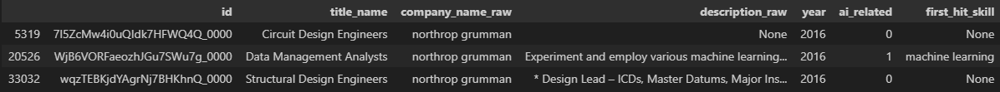
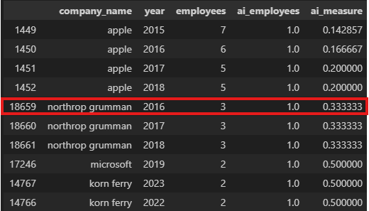

# Replication Guide  
This guide documents the data sources, variable construction, and step-by-step procedures used to build a firm-level AI measure from job postings and résumé data. Our methodology follows [Babina et al. (2024)](https://www.sciencedirect.com/science/article/pii/S0304405X2300185X), and we replicate Figure 1(b) from the paper.  
## 1. Job Postings  
In this section, we detail how we construct the firm-level AI measure from job-postings data. We begin with a description of the data, then outline the procedures and explain the purpose and functions of each code file. Finally, we present the replication results.  
### 1.1 Data Description  
We use job-posting data purchased from Lightcast. The dataset contains standard fields such as company name, job title, and required skills, spanning 2010–2025. Because the raw pulls from Lightcast arrive as multiple extracts, we reorganize them with basic OS-level file operations. Specifically, we create a top-level directory `jobs_by_year` with subdirectories `2010`, `2011`, …, `2025`; each subdirectory holds multiple Parquet files with the original records. This structure makes it easier to manage and process the large volume of data. Below, we report the file structure and the record counts by year:  
<details>
  <summary><b>jobs_by_year/</b></summary>
  <ul>
    <li>
      <details>
        <summary><code>2010/</code></summary>
        <ul>
          <li><code>parquet/</code>
            <ul>
              <li><code>part.0.parquet</code></li>
              <li><code>part.1.parquet</code></li>
            </ul>
          </li>
        </ul>
      </details>
    </li>
    <li>
      <details>
        <summary><code>2011/</code></summary>
        <ul>
          <li><code>parquet/</code>
            <ul>
              <li><code>part.0.parquet</code></li>
              <li><code>part.1.parquet</code></li>
            </ul>
          </li>
        </ul>
      </details>
    </li>
    <li><code>...</code></li>
  </ul>
</details>
<details>
  <summary><b>Yearly record counts (2010–2025)</b></summary>

| Year | Count        |
|:----:|--------------|
| 2010 | 12462425     |
| 2011 | 15265548     |
| 2012 | 15075969     |
| 2013 | 20810346     |
| 2014 | 22389352     |
| 2015 | 24939638     |
| 2016 | 26388936     |
| 2017 | 26249858     |
| 2018 | 33194240     |
| 2019 | 34490965     |
| 2020 | 34732350     |
| 2021 | 43723499     |
| 2022 | 48610981     |
| 2023 | 38914101     |
| 2024 | 36845527     |
| 2025 | 21877827     |

</details>  

### 1.2 Procedures  
1. Explode each record by parsing the `skills_name` field (e.g., pipe-delimited) to create one row per (job_id, skill).  
   <details>
      <summary><b>Example: before → after</b></summary>

    **Before (one row, pipe-delimited skills)**

    | ID    | skills_name          |
    |:----: |----------------------|
    | 12345 | `Python\|Stata\|C++` |

    **After (exploded to one row per skill)**

    | ID    | skills_name |
    |:----: |------------|
    | 12345 | Python     |
    | 12345 | Stata      |
    | 12345 | C++        |

    </details>

2. Group the data by skill to compute (i) the total frequency of each skill and (ii) its co-occurrence count with AI terms.
3. Step (1) and (2) are executed by year and then aggregated across all years. Once we have, for each skill $s$, its total appearances and its co-occurrences with AI terms, we compute the AI score $w_{S}^{AI}$. Specifically,  
   
```math
w_{s}^{AI} = \frac{\text{\# jobs with } s \text{ and AI terms}}{\text{\# jobs with } s}
```
4. Given skill-level AI scores, we compute a job-level AI score ($w_j^{AI}$) by averaging the AI scores of all required skills for job $j$. If job $j$ requires skills $A$, $B$, and $C$ with $w_A^{AI}=0.5$, $w_B^{AI}=0.7$, and $w_C^{AI}=0.3$, then:
```math
w_{j}^{AI} = \frac{0.5 + 0.7 + 0.3}{3} = 0.5
```
5. Transform the continuous AI score into a binary indicator by defining each job $j$ as AI-related if the measure $w_{j}^{AI}$ is above 0.1.
6. The firm-level measure $Share_{f,t}^{AI}$ is defined as the fraction of job by firm $f$ in year $t$ that are AI-related.

### 1.3 Code Files  
* `01_extract_term1.py`: This code executes steps (1) and (2) for a specified year. It explodes the `skills_name` field into one row per `(ID, skill)`, then aggregates per-skill totals and AI co-occurrences. To use it, set `YEAR` (e.g., `year=2010`) to process that year; the script writes the result to the `out/` directory as `YYYY_skills_counts_co.parquet`. For example, with `YEAR=2010`, it produces `out/2010_skills_counts_co.parquet`, which contains every skill appears in that year, its number of appearance, and it number of co-occurrence with key AI terms. All outputs are written to the `out/` directory.  
* `02_extract_term2.py`: This code executes step (3). It aggregates the per-year outputs from steps (1) and (2) to produce, for each skill, its total number of appearances, its total co-occurrences with AI terms, and the resulting AI score. Users can run the script without any manual input, it automatically locates the files generated in steps (1) and (2) and performs the aggregation. The final output is `all_years_skills_counts_co.parquet`, which lists the AI score for every skill. If you want a top-k list, adjust the `LIMIT` in the final SQL query to return the highest-scoring skills and save it in `top100_ai_skills_all_years.parquet` (feel free to rename it—for example, top200_... or top300_...—to match your chosen k). All outputs are written to the `out/` directory.  
* `03_jp_measure.py`: This code executes steps (4), (5), and (6). It computes a job-level AI score $w_{j}^{AI}$ for every posting, assigns a binary AI indicator, and then groups by company to compute the firm-year AI share $Share_{f,t}^{AI}$. The script requires a `YEAR` input; for example, setting `YEAR=2010` produces `out/2010_job_ai_scores.parquet` and `out/2010_company_ai_share.parquet`. The first file reports each job's $w_{j}^{AI}$ (and related counts), while the second aggregates those job scores to the firm level to obtain $Share_{f,t}^{AI}$. All outputs are written to the `out/` directory.

**If you have any questions about the calculation details, please reach out or check the code. I've written it for clarity and included detailed comments.**  

### 1.4 Replication Result  
In this section, we replicate Figure 1(b) from [Babina et al. (2024)](https://www.sciencedirect.com/science/article/pii/S0304405X2300185X). Please refer to the paper for more details.  
   

## 2. Résumé  
In this section, we develop a firm-level AI measure from résumé data. We first describe the dataset, then outline the computational steps used to obtain the measure, and finally provide a brief overview of the code files.  
### 2.1 Data Description  
The résumé data used in this section also comes from Lightcast. We additionally rely on the file `top100_ai_skills_all_years.parquet` generated in the previous section. The key variables are `title_name` and `description_raw`. Using these fields, we classify each profile as AI-related or non-AI-related by checking whether they contain any AI terms listed in `top100_ai_skills_all_years.parquet`.  
### 2.2 Procedures  
1. We expand each profile into one row per year between the job's start and end dates. This lets us classify an employee as AI-related or non-AI-related in each calendar year.
   <details>
      <summary><b>Example: before → after</b></summary>

    **Before (one row)**

    | ID    | title_name           | JOB_START_YM   | JOB_END_YM   |
    |:----: |----------------------|----------------|--------------|
    | 12345 | Product Manager      | 2022-08        | 2024-05      |

    **After (exploded to one row per year)**

    | ID    | title_name          | YEAR   | 
    |:----: |---------------------|--------|
    | 12345 | Product Manager     | 2022   |
    | 12345 | Product Manager     | 2023   |
    | 12345 | Product Manager     | 2024   |

    </details>  

2. Using the keyword list in `top100_ai_skills_all_years.parquet`, we check whether each row's `title_name` or `description_raw` contains any listed term. If a match is found, we record the first matching term and mark the observation as `ai_related=1`.
3. Finally, we aggregate by `company_name` and `year`. For each firm-year, we compute our AI measure as the share of employees classified as AI-related: the number of AI-related employees divided by the total number of employees. See example from the result:



### 2.3 Code Files  
* `04_resume.py`: This code implements steps (1)-(3). It expands each profile into one row per year using `JOB_START_YM` and `JOB_END_YM`, classifies each row as AI-related or non-AI-related, and then aggregates to a firm-year AI measure. The input is a sample résumé data, and the script outupts a single firm-year file containing all firns in the sample with their corresponding AI measure. When the full dataset becomes available, users can reuse this code with minor adjustments (e.g., updating file paths or iterating over multiple input files).

**If you have any questions about the calculation details, please reach out or check the code. I've written it for clarity and included detailed comments.**  

## 3. Supplementary Materials  
In our analysis, we mainly use DuckDB to manipulate the data. DuckDB is an in-process, analytics-focused SQL database that runs inside our application without a server and without setup. It uses columnar storage and vectorized execution, so aggregations, joins, and window functions run quickly on large files. It can read and write CSV and Parquet directly and it works smoothly with DataFrames in Python. This makes it well suited for reproducible data pipelines where you clean, transform, and export data in a single lightweight script. Please refer to the [documentation](https://duckdb.org/docs/stable/clients/python/overview) for further details.


